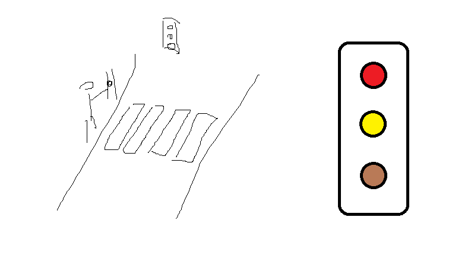

# Зробити світлофор

- ігнорування повторного натискання якщо не пройшов певний час
- спрацьовує через секунду після натискання і не частіше раз на 5 секунд
- червоний для машин загорається на 3 секунди

