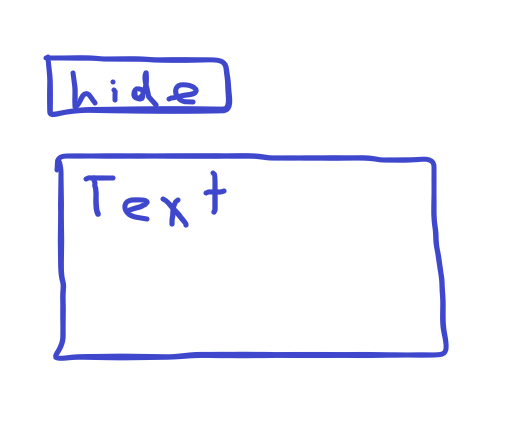
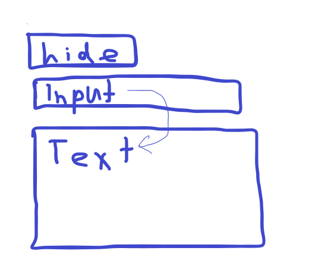

# ДЗ

## Lvl-1

* Створити кнопку з назвою показати/сховати
* Нижче створити статтю
* При натисканні кнопка має показувати/ховати текст
* На самій кнопці теж має змінюватись текст - Показати/Сховати

## Lvl-2

* Добавити Input
* При введені тексту в Input, в полі з текстом має відображатись уведений текст

## Lvl-3

* Добавати стилів